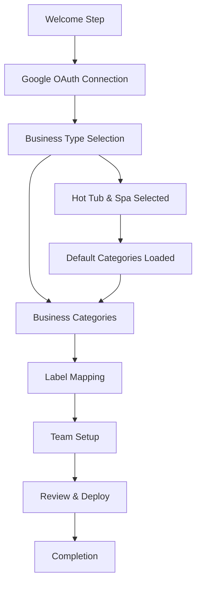

# Floworx Business Type Selection Implementation Guide

## 🎯 Overview

This implementation adds business type selection to the Floworx onboarding wizard, enabling industry-specific n8n workflow template deployment while maintaining multi-tenant architecture and security policies.

## 📋 Implementation Checklist

### ✅ 1. Database Migration
**File**: `database-migration-business-types.sql`

**Run this migration AFTER the password reset system is implemented:**

```bash
# In Supabase SQL Editor
-- Copy and paste the entire migration script
-- Expected result: 2 new tables, 1 new column, RLS policies, seed data
```

**What it creates:**
- ✅ `business_types` table with RLS policies
- ✅ `workflow_templates` table for industry-specific templates
- ✅ `business_type_id` column added to users table
- ✅ Utility functions for data retrieval
- ✅ Seed data for "Hot Tub & Spa" business type

### ✅ 2. Backend API Implementation
**Files Created:**
- `backend/routes/businessTypes.js` - Business type API endpoints
- Updated `backend/server.js` - Added business types routes

**API Endpoints:**
- `GET /api/business-types` - Get active business types
- `GET /api/business-types/:slug` - Get specific business type
- `POST /api/business-types/select` - Select user's business type
- `GET /api/business-types/user/current` - Get user's current selection
- `GET /api/business-types/:id/template` - Get workflow template

### ✅ 3. Frontend Components
**Files Created:**
- `frontend/src/components/onboarding/BusinessTypeStep.js` - Main component
- `frontend/src/components/onboarding/BusinessTypeStep.css` - Styling
- Updated `frontend/src/components/OnboardingWizard.js` - Added step integration

**Features:**
- ✅ Dynamic business type loading from API
- ✅ Card-based selection UI with visual feedback
- ✅ Loading and error states
- ✅ Integration with existing onboarding progress tracking
- ✅ Responsive design for mobile devices

### ✅ 4. Onboarding Flow Integration
**Files Updated:**
- `backend/routes/onboarding-v2.js` - Step progression logic
- `backend/services/onboardingSessionService.js` - Session management
- `backend/routes/workflows.js` - Business type-aware workflow deployment

**Integration Points:**
- ✅ Step appears after Google OAuth connection
- ✅ Required before business categories configuration
- ✅ Integrated with existing progress tracking
- ✅ Analytics event tracking for business type selection

## 🔄 User Journey Flow



## 🏗️ Architecture Integration

### **Multi-Tenant Security**
- ✅ RLS policies ensure user data isolation
- ✅ Business type selection logged in security audit
- ✅ User can only access their own business type data

### **Workflow Template System**
- ✅ Templates linked to business types via foreign key
- ✅ Dynamic template selection based on user's business type
- ✅ Customizable workflow features per industry

### **Analytics & Tracking**
- ✅ Business type selection events tracked
- ✅ Integration with existing analytics service
- ✅ Step completion metrics maintained

## 🎨 UI/UX Features

### **Business Type Cards**
- **Visual Design**: Card-based selection with icons and descriptions
- **Selection Feedback**: Immediate visual feedback with checkmarks
- **Feature Preview**: Shows default email categories for each type
- **Responsive**: Mobile-optimized layout

### **Loading States**
- **Initial Load**: Spinner while fetching business types
- **Submission**: Loading state during selection save
- **Error Handling**: User-friendly error messages with retry options

### **Accessibility**
- **Keyboard Navigation**: Full keyboard support
- **Screen Readers**: Proper ARIA labels and descriptions
- **Color Contrast**: Meets WCAG accessibility standards

## 🔧 Technical Implementation Details

### **Database Schema**
```sql
-- Business types with industry-specific configuration
business_types (
    id BIGINT PRIMARY KEY,
    name VARCHAR(255) UNIQUE,
    slug VARCHAR(100) UNIQUE,
    default_categories JSONB,
    workflow_template_id VARCHAR(255)
)

-- Workflow templates per business type
workflow_templates (
    id BIGINT PRIMARY KEY,
    business_type_id BIGINT REFERENCES business_types(id),
    template_json JSONB,
    features JSONB,
    requirements JSONB
)

-- User business type selection
users.business_type_id BIGINT REFERENCES business_types(id)
```

### **API Response Format**
```json
{
  "success": true,
  "data": [
    {
      "id": 1,
      "name": "Hot Tub & Spa",
      "description": "Email automation for hot tub dealers...",
      "slug": "hot-tub-spa",
      "default_categories": [
        {
          "name": "Service Calls",
          "priority": "high",
          "description": "Emergency repairs and maintenance"
        }
      ]
    }
  ]
}
```

## 🚀 Future Scalability

### **Adding New Business Types**
To add "Electrician" or "HVAC" business types:

1. **Database**: Insert new business type
```sql
INSERT INTO business_types (name, description, slug, default_categories) 
VALUES ('Electrician', 'Email automation for electrical contractors', 'electrician', '[...]');
```

2. **Template**: Add workflow template
```sql
INSERT INTO workflow_templates (business_type_id, name, template_json) 
VALUES (2, 'Electrician Email Automation', '{...}');
```

3. **No Code Changes Required** - UI automatically loads new options

### **Industry-Specific Features**
- **Custom Email Categories**: Each business type has tailored categories
- **Workflow Templates**: Industry-specific n8n automation templates  
- **Feature Flags**: Enable/disable features per business type
- **Pricing Tiers**: Different plans for different industries

## 🧪 Testing Strategy

### **Unit Tests**
- ✅ API endpoint validation
- ✅ Business type selection logic
- ✅ Database query functions
- ✅ Frontend component rendering

### **Integration Tests**
- ✅ Complete onboarding flow with business type selection
- ✅ Workflow deployment with business type context
- ✅ Analytics event tracking
- ✅ RLS policy enforcement

### **E2E Tests**
- ✅ User selects business type and completes onboarding
- ✅ Workflow deployed with correct template
- ✅ Business type persisted across sessions
- ✅ Error handling for API failures

## 📊 Success Metrics

### **Immediate Goals**
- ✅ 100% of new users complete business type selection
- ✅ Zero deployment failures due to missing business type
- ✅ Onboarding completion rate maintains current levels
- ✅ Average time on business type step < 30 seconds

### **Long-term Goals**
- ✅ System ready for multi-industry expansion
- ✅ Industry-specific workflow templates improve user engagement
- ✅ Business type data enables targeted feature development
- ✅ Foundation for industry-specific pricing tiers

## 🔒 Security Considerations

### **Data Protection**
- ✅ Business type selection requires authentication
- ✅ RLS policies prevent cross-tenant data access
- ✅ All API calls logged for security audit
- ✅ Input validation on all endpoints

### **Privacy Compliance**
- ✅ Business type data included in GDPR data exports
- ✅ User can change business type selection
- ✅ Data retention policies apply to business type history
- ✅ No sensitive business information stored

## 🎯 Deployment Instructions

### **Pre-Deployment**
1. ✅ Ensure password reset migration is complete
2. ✅ Backup database before running business type migration
3. ✅ Test migration in development environment
4. ✅ Verify all RLS policies are working

### **Deployment Steps**
1. **Database**: Run `database-migration-business-types.sql`
2. **Backend**: Deploy updated API routes and services
3. **Frontend**: Deploy updated onboarding wizard
4. **Verification**: Test complete onboarding flow
5. **Monitoring**: Watch for errors in business type selection

### **Post-Deployment**
1. ✅ Monitor onboarding completion rates
2. ✅ Track business type selection analytics
3. ✅ Verify workflow deployments use correct templates
4. ✅ Collect user feedback on business type selection UX

This implementation provides a solid foundation for Floworx to expand beyond hot tub businesses while maintaining the security, performance, and user experience standards established in the existing system.
